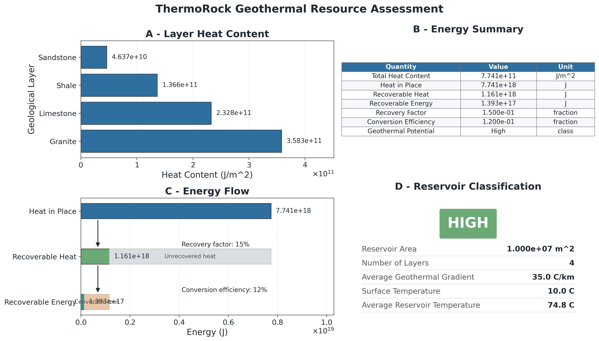
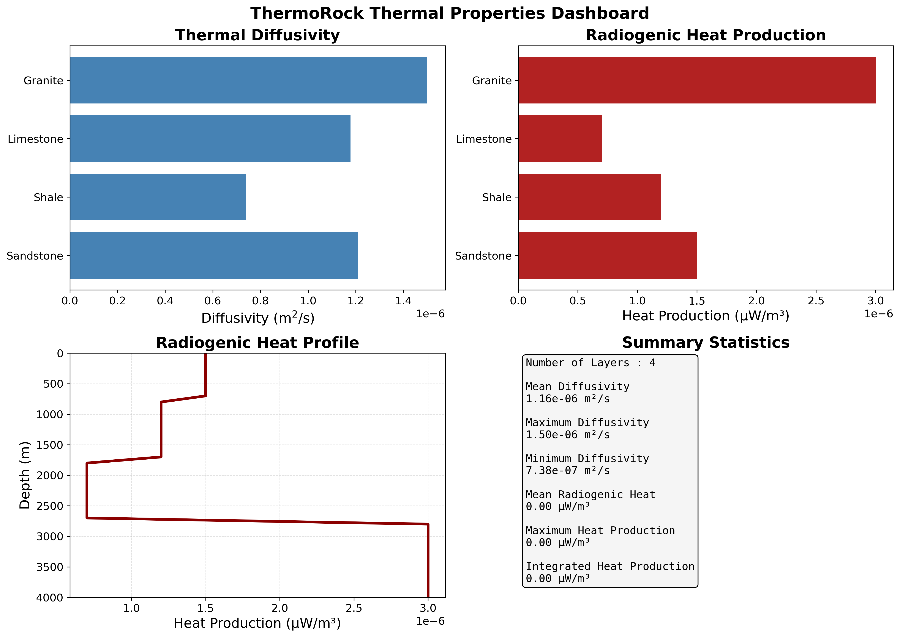

# ThermoRock

> A Python package for thermal property analysis, conductive heat transfer modelling, and geothermal resource assessment.

---

## Overview

ThermoRock is an open-source Python package for thermal property analysis, conductive heat transfer modelling, and geothermal resource assessment. It integrates thermal property calculations, one-dimensional heat transfer, geothermal resource analysis, and scientific visualization into a modular and reusable software framework.

The package was developed following Sustainable Computational Engineering (SCE) principles, including modular software design, object-oriented programming, reproducibility, validation, documentation, and automated testing.

ThermoRock supports reproducible computational workflows for geothermal engineering and geoscience research and is designed to be easily extended for future developments.

## Features

- Rock property database for common geological materials
- Thermal property calculations
- Thermal diffusivity estimation
- Radiogenic heat production modelling
- One-dimensional steady-state conductive heat transfer
- Geothermal resource assessment
- Input validation and error checking
- Scientific visualization and figure generation
- Automated export of figures and summary tables
- Modular and object-oriented software architecture


## Installation

Clone the repository:

```bash
git clone https://github.com/shekochild/ThermoRock.git
cd ThermoRock
```

Create and activate a virtual environment (recommended):

```bash
python -m venv .venv
```

**Windows**

```bash
.venv\Scripts\activate
```

**Linux/macOS**

```bash
source .venv/bin/activate
```

Install ThermoRock in editable mode:

```bash
pip install -e .
```

Verify the installation:

```bash
python -c "import thermorock; print('ThermoRock installed successfully!')"
```

## Requirements

ThermoRock requires:

- Python 3.10 or later
- NumPy
- Matplotlib

Additional dependencies are installed automatically when installing the package in editable mode:

```bash
pip install -e .
```


## Quick Start

The example below demonstrates the basic ThermoRock workflow: defining rock properties, building a layered subsurface model, solving the steady-state temperature profile, and displaying the computed temperatures.

```python
from thermorock.heat_transfer import HeatTransferSolver
from thermorock.subsurface import Layer, Rock, Subsurface

sandstone = Rock(
    "Sandstone",
    thermal_conductivity=2.5,
    density=2300,
    heat_capacity=900,
    radiogenic_heat_production=1.5e-6,
)

shale = Rock(
    "Shale",
    thermal_conductivity=1.8,
    density=2500,
    heat_capacity=850,
    radiogenic_heat_production=1.0e-6,
)

model = Subsurface(
    surface_temperature=10.0,
    geothermal_gradient=30.0,
)

model.add_layer(Layer(0, 500, sandstone))
model.add_layer(Layer(500, 1500, shale))

solver = HeatTransferSolver(model)

depths, temperatures = solver.finite_difference_steady_state(
    spacing=250
)

for depth, temperature in zip(depths, temperatures):
    print(f"{depth:.0f} m : {temperature:.2f} °C")
```

A complete working example is available in:

```text
examples/basic_workflow.py
```

## Example Outputs

ThermoRock generates scientific figures and dashboards for thermal property analysis, conductive heat transfer, and geothermal resource assessment.

### Geothermal Resource Assessment Dashboard



*Integrated dashboard showing layer heat content, geothermal energy estimates, recoverable energy, and reservoir classification.*

---

### Thermal Properties Dashboard



*Dashboard summarizing thermal diffusivity, radiogenic heat production, and thermal property statistics for the geological model.*


## Software Architecture

ThermoRock follows a modular workflow in which geological data are validated, assembled into a subsurface model, processed by specialised computational modules, and finally visualised through scientific figures and dashboards.

```text                
                 Input Data
      (Rock properties & Parameters)
                    │
                    ▼
         Validation & Range Checking
                    │
                    ▼
             Geological Model
        (Rock, Layer, Subsurface)
                    │
     ┌──────────────┼──────────────┐
     ▼              ▼              ▼
 Heat Transfer   Diffusivity   Geothermal
     └──────────────┼──────────────┘
                    ▼
      Geothermal Resource Analysis
                    │
                    ▼
     Scientific Visualization & Export
```


## Package Architecture


The main source code is located in `src/thermorock`.

| Module |  Responsibility  |
|---------|-------------|
| `subsurface.py` | Defines the core geological objects (`Rock`, `Layer`, and `Subsurface`). |
| `heat_transfer.py` | Implements one-dimensional steady-state conductive heat transfer. |
| `analysis.py` | Performs geothermal resource assessment and energy calculations. |
| `geothermal.py` | Provides geothermal property calculations, including radiogenic heat production. |
| `diffusivity.py` | Calculates thermal diffusivity from rock properties. |
| `database.py` | Stores thermal property ranges for common geological materials. |
| `visualization.py` | Generates scientific figures and dashboards. |
| `validation.py` | Performs input validation. |
| `range_validation.py` | Checks that physical property values lie within acceptable ranges. |


## Project Structure

```text
ThermoRock/
├── docs/                 Documentation and figures
├── examples/             Example workflows and demonstrations
├── results/              Generated analysis outputs
├── src/
│   └── thermorock/
│       ├── analysis.py          Geothermal resource assessment
│       ├── database.py          Rock property database
│       ├── diffusivity.py       Thermal diffusivity calculations
│       ├── geothermal.py        Geothermal property calculations
│       ├── heat_transfer.py     Steady-state heat transfer solver
│       ├── range_validation.py  Physical range validation
│       ├── subsurface.py        Geological model classes
│       ├── validation.py        Input validation
│       └── visualization.py     Scientific visualization
├── tests/                Unit tests
├── README.md
├── LICENSE
└── pyproject.toml
```


## Documentation and Examples

ThermoRock includes several example scripts that demonstrate different components of the package.

| Example | Description |
|---------|-------------|
| `examples/basic_workflow.py` | Introduces the core workflow by creating rock objects, building a layered subsurface model, and computing a steady-state temperature profile. |
| `examples/geothermal_profile.py` | Demonstrates geothermal gradient calculations and temperature profile visualization. |
| `examples/geothermal_assessment.py` | Provides a comprehensive demonstration of the package, including thermal property analysis, heat-transfer modelling, geothermal resource assessment, dashboard generation, and figure export. |

These examples can be executed directly after installing ThermoRock.


## Citation

If you use ThermoRock in research, teaching, or other academic work, please cite the software appropriately.

```text
Joseph, T. (2026). ThermoRock: A Python package for thermal property analysis,
conductive heat transfer modelling, and geothermal resource assessment.
Version 0.1.0.
https://github.com/shekochild/ThermoRock
```

## License

ThermoRock is released under the MIT License.

The MIT License permits the use, modification, and distribution of this software, provided that the original copyright notice and license are retained.

For the complete license terms, see the [LICENSE](LICENSE) file.

## Author

**Titus Joseph**

M.Sc. Applied Geosciences  
RWTH Aachen University

GitHub: https://github.com/shekochild

## Future Development

Planned extensions include:

- Transient (time-dependent) heat transfer modelling
- Two-dimensional and three-dimensional heat transport
- Additional rock property databases from published   literature
- Improved geothermal reservoir modelling
- Extended validation against benchmark problems
- Interactive visualisation tools

## Acknowledgements

ThermoRock was developed as part of the Sustainable Computational Engineering coursework in the M.Sc. Applied Geosciences programme at RWTH Aachen University.